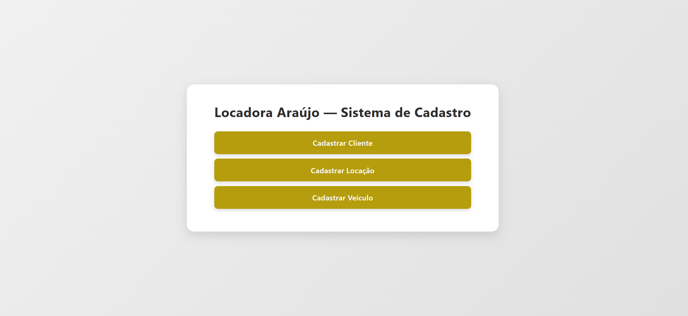

# 🚗 Locadora Araújo — Sistema de Cadastro e Gestão de Veículos

Uma aplicação web completa desenvolvida para gerenciar o ecossistema de uma locadora de automóveis. O sistema possui interfaces amigáveis e implementa operações completas de **CRUD** (Create, Read, Update, Delete) para o controle eficiente de clientes, veículos e contratos de locação.

---

## 🚀 Funcionalidades Principais

* **👤 Gestão de Clientes:** Cadastro, consulta, atualização e remoção de clientes no sistema.
* **🔑 Controle de Locações:** Registro e monitoramento dos contratos de locação realizados.
* **🚘 Cadastro de Veículos:** Controle do catálogo de automóveis disponíveis para locação na frota.
* **💾 Operações CRUD Completas:** Persistência robusta de dados integrada diretamente com o banco de dados.

---

## 🛠️ Tecnologias Utilizadas

O projeto foi construído utilizando tecnologias consolidadas para o desenvolvimento web dinâmico:

* **Back-end:** PHP (Processamento de requisições, validação de formulários e lógica de negócios).
* **Banco de Dados:** MySQL (Modelagem relacional e armazenamento seguro dos dados).
* **Front-end:** HTML5 (Estruturação semântica) e CSS3 (Estilização moderna e layout limpo).

---

## 📦 Como Executar o Projeto Localmente

Para rodar este projeto no seu computador, você precisará de um ambiente de desenvolvimento local com suporte a PHP e MySQL (como o **XAMPP**, **WampServer** ou **Laragon**).

### Passos para Configuração:

1. Na página principal deste repositório, clique no botão verde **"Code"** e escolha **"Download ZIP"**.
2. Extraia o conteúdo do arquivo ZIP dentro do diretório raiz do seu servidor local (ex: `C:/xampp/htdocs/` no XAMPP).
3. Abra o seu gerenciador do banco de dados (ex: `http://localhost/phpmyadmin`).
4. Crie um novo banco de dados (ex: `locadora_araujo`).
5. Importe o arquivo `.sql` do seu projeto para estruturar automaticamente as tabelas de clientes, veículos e locações.
6. Certifique-se de que as credenciais de usuário e senha no seu arquivo de conexão PHP estão condizentes com o seu ambiente local.
7. Abra o navegador e acesse: `http://localhost/sistema-locadora-carros/`

---

## 🎨 Demonstração Visual

| Painel Principal — Sistema de Cadastro |
| :---: |
| 
]) |

---

# 👨‍💻 Autor

Matheus Araujo da Silva

- Site/Portifólio: https://matheus-araujo.net.br
- GitHub: https://github.com/matheusaraujo019
- LinkedIn: https://www.linkedin.com/in/matheus-araujo-da-silva-9a082b388/

---

# 📄 Licença

Este projeto está sob a licença MIT.
